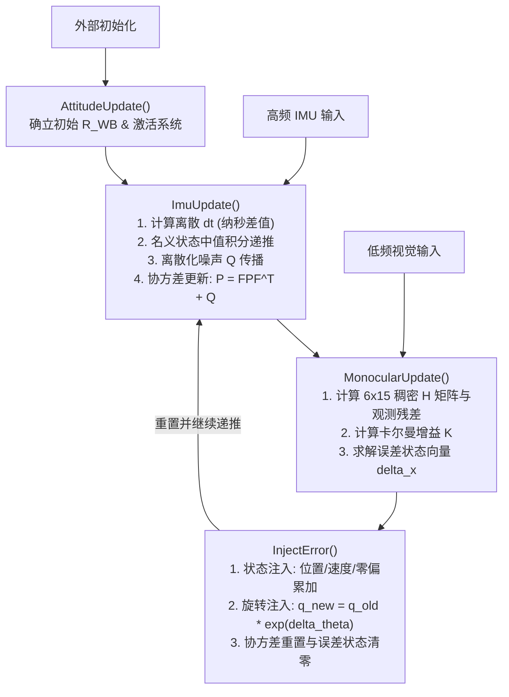

# 软件需求规格说明书 (SRS)：基于松耦合 ESKF 的无人机姿态解算系统

## 1. 引言

### 1.1 目的
本构想书旨在确立一个基于松耦合误差状态卡尔曼滤波 (Error-State Kalman Filter, ESKF) 的视觉惯性姿态解算系统的核心需求与软件架构规范。该系统专为短航程无人机 (UAV) 设计，用于在 GPS 信号缺失或微弱的环境下提供高频、鲁棒的位姿（位置、速度、朝向）估计。

### 1.2 系统背景
在现代无人机自主导航中，紧耦合系统（如 ORB-SLAM3）虽然精度高，但计算开销巨大。本系统通过“松耦合”架构，将视觉前端输出的相对运动观测独立出来，作为 ESKF 的测量输入，并以高频 IMU 作为状态递推的主驱动，以在有限的算力平台上实现高性能的姿态解算。

---

## 2. 系统输入数据需求

系统必须支持三种核心输入源，所有数据结构必须保证高效的内存对齐和类型安全。

### 2.1 惯性测量数据 (IMU Data)
* **数据结构定义**：`DatumImuImpl`
* **时钟源**：高分辨率单调时钟，时间戳 `timestamp_` 使用 `std::int64_t` 存储，单位为纳秒 (ns)。
* **物理量要求**：
    * 角速度向量 `angular_velocity_`：3维向量（`Eigen::Vector3`），单位为 $rad \cdot s^{-1}$。
    * 线加速度向量 `linear_acceleration_`：3维向量（`Eigen::Vector3`），单位为 $m \cdot s^{-2}$。
* **坐标系约束**：调用者必须确保 IMU 原始读数已转换至**机体参考坐标系（Body Frame，简记为 $B$ 或 $I$）**下。

### 2.2 单目视觉观测数据 (Monocular Visual Data)
* **数据结构定义**：`DatumFastImpl`
* **时钟源**：时间戳 `timestamp_` 使用 `std::int64_t` 存储，单位为纳秒 (ns)。
* **物理量要求**：
    * 相对角位移向量 `angular_displacement_`：3维向量（`Eigen::Vector3`），表示相邻帧间的旋转轴角，单位为弧度 ($rad$)。
    * 单位化平移向量 `normalized_translation_`：3维向量（`Eigen::Vector3`），由于单目视觉的尺度不确定性，该量必须为无单位的同向单位向量。
* **坐标系与外参约束**：调用者必须通过相机到机体的外参矩阵（$T_{BS}$）进行预处理，确保传入 ESKF 的观测数据是在**机体参考坐标系**下的表达。

### 2.3 初始朝向数据 (Initial Attitude)
* **数据结构定义**：`Sophus::SO3` (简写为 `Attitude`)
* **物理意义**：表示机体坐标系相对于世界导航坐标系（World Frame，简记为 $W$）的初始旋转矩阵 $R_{WB}$。

---

## 3. 数学模型与状态空间需求

系统内部必须严格维护两套状态变量：名义状态（用于高频轨迹递推）与误差状态（用于卡尔曼滤波优化）。

### 3.1 变量空间与维度约束
* **观测空间维度 (`dimMonocularData`)**：固定为 6 维。
* **误差状态空间维度 (`dimErrorState`)**：固定为 15 维。
* **重力约束**：不将重力加速度计加入状态空间。重力在世界坐标系下视为常数，标称大小 $g = 9.81 m/s^2$，矢量方向定义为世界坐标系的 Z 轴负方向：$g_W = [0, 0, -9.81]^T$。

### 3.2 名义状态变量 (Nominal State, $x$)
名义状态描述大范围的非线性运动运动学，包含以下 5 个分量：
1.  **位置 ($r^{iv}_i$)**：3维向量，载具在世界系下的绝对位置。
2.  **线速度 ($\dot{r}^{iv}_i$)**：3维向量，载具在世界系下的绝对速度。
3.  **朝向 ($C_{iv}$)**：四元数形式（`Eigen::Quaternion`），表示从机体系到世界系的旋转。
4.  **加速度计零偏 ($b_a$)**：3维向量，慢变随机游走噪声。
5.  **陀螺仪零偏 ($b_g$)**：3维向量，慢变随机游走噪声。

### 3.3 误差状态变量 (Error State, $\delta x$)
误差状态定义为真实状态与估计状态之差（$\delta x = x_{true} - x_{est}$），是完美的欧氏空间向量，包含：
1.  **位置误差 ($\delta p$)**：3维向量。
2.  **线速度误差 ($\delta v$)**：3维向量。
3.  **旋转误差 ($\delta \theta$)**：3维向量，采用**李代数 $\mathfrak{so}(3)$ 的轴角形式**表示切空间扰动。
4.  **加速度计零偏误差 ($\delta b_a$)**：3维向量。
5.  **陀螺仪零偏误差 ($\delta b_g$)**：3维向量。

---

## 4. 功能模块与算法流程需求

<!-- 程序流程图 -->

### 4.1 初始化模块 (`AttitudeUpdate`)
* **触发条件**：系统启动后，在未接收常规数据前由调用者主动触发。
* **核心功能**：接收静止状态下估计的初始姿态。
* **特殊退化处理 (针对 EuRoC MAV 等数据集)**：由于设备安装倾斜，无法假设重力与 IMU 的 Z 轴平行。系统必须通过传入的 `Sophus::SO3` 矩阵建立初始的 $R_{WB}$，将重力准确投影到机体轴上。
* **状态变更**：成功调用后，`is_initialized_` 标志位置为 `true`。

### 4.2 预测模块 (`ImuUpdate`)
* **触发频率**：与 IMU 硬件采样率保持一致（高频，通常 $\ge 200Hz$）。
* **时间戳处理**：
    * 第一帧 IMU 数据仅用于记录 `last_imu_time_`，不进行递推。
    * 后续帧通过 `(imu_data->timestamp_ - last_imu_time_) * 1e-9` 准确计算离散步长 $\Delta t$（单位：秒）。
* **名义状态递推**：使用中值积分法（Mid-point Integration）更新位置、速度与朝向。
* **噪声离散化**：输入的噪声参数（`accelerometer_noise_`等）为连续时间噪声密度。在构建离散系统噪声协方差矩阵 $Q_k$ 时，必须显式根据 $\Delta t$ 进行缩放：
    * 白噪声项：$\sigma^2_{discrete} = \sigma^2_{continuous} / \Delta t$
    * 随机游走项：$\sigma^2_{discrete} = \sigma^2_{continuous} \cdot \Delta t$
* **协方差传播**：根据 15 维状态转移矩阵 $F$，计算并更新误差状态协方差：
    $$P_k = F_k P_{k-1} F_k^T + Q_k$$

### 4.3 更新模块 (`MonocularUpdate`)
* **触发频率**：由视觉帧到达驱动（低频，通常 $10Hz \sim 30Hz$）。
* **置信度拦截**：如果 `is_initialized_` 为 `false`，直接拒绝更新。
* **矩阵运算规范**：
    * 鉴于状态和观测规模极小（$6 \times 15$），**严禁使用任何稀疏矩阵（`Eigen::SparseMatrix`）结构**。
    * 必须使用固定大小的稠密矩阵 `Eigen::Matrix<value_type, 6, 15>` 定义观测雅可比矩阵 $H$。
    * 利用 Eigen 编译期完全展开与 SIMD 优化的特性，确保高效率的卡尔曼增益 $K = PH^T(HPH^T + R)^{-1}$ 计算。
* **状态注入与重置 (`InjectError`)**：
    * 更新计算完成后，必须立即触发注入。
    * 位置、速度、零偏采用标准的线性加法修正：$p = p + \delta p$。
    * 旋转必须采用严谨的**李群乘法（右扰动或左扰动，系统内需保持一致）**进行复合更新：
        $$q_{new} = q_{old} \otimes \text{Quaternion}(\text{Sophus::SO3}::\text{exp}(\delta \theta))$$
    * 注入完毕后，误差状态向量 `error_state_` 必须**立即强制清零**，并更新协方差矩阵以防止滤波器发散。

---

## 5. 非功能性需求与工程规范

### 5.1 内存安全性
* **对齐要求**：所有涉及 Eigen 矩阵、四元数和 Sophus 李群的结构体，必须确保满足内存对齐要求（如在 32 字节或 64 字节边界对齐，尤其在模板实例化为 `double` 或 `float` 时）。
* **布局约束**：`NominalStateVariable` 和 `ErrorStateVariable` 结构体必须保持为 **POD (Plain Old Data) / 标准布局 (Standard Layout)**，内部禁止包含虚函数或动态指针，以确保利用 `sizeof` 进行维度断言的安全。

### 5.2 状态读取与接口设计
* **零拷贝映射**：为了兼顾“矩阵数学运算的整体性”与“业务层读写分量的便利性”，当内部或外部需要读写 15 维长向量时，应当通过 `Eigen::Map` 对指针进行强类型桥接，避免内存拷贝。
* **数据导出**：提供标准的 `GetNominalState()` 常量成员函数，供无人机控制飞行控制系统（如底层的姿态控制回路）安全、无锁地读取最新高频预测位姿。
